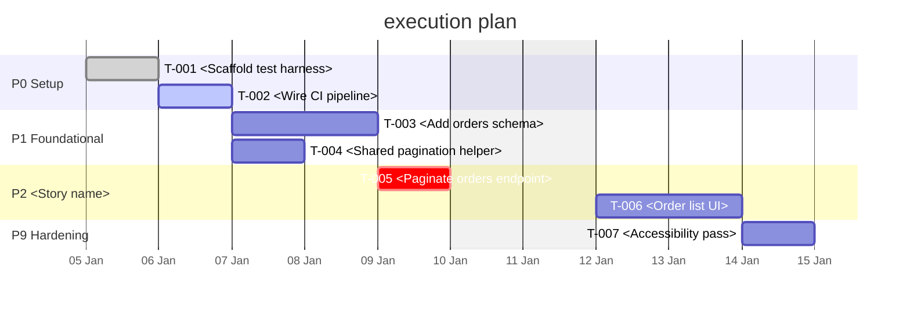

# Execution Plan — <Feature Name>

> **Generated view — do not hand-edit.** The task table and Gantt chart below are rendered
> from GitHub Issues and the Projects v2 board. Change tasks with the `sdlc-tracker` MCP
> tools (`task_update`, `plan_sync`), then regenerate this file. Edits made here are lost
> on the next refresh.

| Field     | Value                            |
| --------- | -------------------------------- |
| Feature   | `<NNN-feature-slug>`             |
| Board     | `<https://github.com/orgs/<org>/projects/<n>>` |
| Milestones | `<n>`                           |
| Generated | `<YYYY-MM-DDTHH:MM:SSZ>`         |
| Source    | `work-breakdown.md` \| `.specify/tasks.md` |

## Status

| Phase | Tasks | Done | In progress | Blocked | Est. remaining (h) | Progress |
| ----- | ----- | ---- | ----------- | ------- | ------------------ | -------- |
| P0 Setup | | | | | | `<n>%` |

**Critical path** `<T-00X> → <T-00Y>` — `<n>` ideal hours.

**Blocked** `<T-00X>` — blocked by `<T-00Y>` \| *(none)*

## Milestones

| Phase | Milestone | Tasks | Estimate (h) | Due |
| ----- | --------- | ----- | ------------ | --- |
| P0    | `<milestone title>` | | | `<YYYY-MM-DD>` |

## Tasks

| ID    | Issue | Title | Phase | Est. (h) | Depends on | Status | Assignee |
| ----- | ----- | ----- | ----- | -------- | ---------- | ------ | -------- |
| T-001 | [#12](https://github.com/<org>/<repo>/issues/12) | <Paginate the orders endpoint> | P2 | 4 | T-000 | Todo \| In progress \| In review \| Done \| Blocked | |

## Execution order

| Wave | Tasks (parallelisable within a wave) |
| ---- | ------------------------------------ |
| 1    | `<T-001>`, `<T-002>`                 |

## Schedule

## Schedule risks

| Risk | Affects | Impact | Response |
| ---- | ------- | ------ | -------- |
|      | `<T-00X>` | Low \| Medium \| High | Accept \| Mitigate \| Avoid |

## How to update

| Change | Tool |
| ------ | ---- |
| Status, estimate, dependencies, assignee | `task_update` |
| Add or restructure tasks | `plan_sync` |
| Regenerate this document | `task_list`, `dependency_graph`, `render_gantt`, `plan_status` |

Never `gh issue edit`. Never hand-edit the task table or Gantt chart above.
