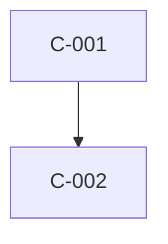

# High Level Design — <Feature Name>

| Field    | Value                                     |
| -------- | ----------------------------------------- |
| Feature  | `<NNN-feature-slug>`                      |
| Status   | Draft \| In review \| Approved \| Superseded |
| Revised  | `<YYYY-MM-DD>`                            |
| Author   | architect (agent-sdlc)                    |
| Source   | `docs/sdlc/<NNN-feature-slug>/frd.md`     |

## Architectural drivers

| Driver | Derived from | Force on the design |
| ------ | ------------ | ------------------- |
| D-1    | `<NFR-###>`  |                     |

## Component inventory

| ID    | Component | Responsibility (one sentence) | Owns data | Serves |
| ----- | --------- | ----------------------------- | --------- | ------ |
| C-001 |           |                               | `<E-1>`   | `<FR-###>` |

## Component interactions

| From | To | Trigger | Sync | Payload (conceptual) |
| ---- | -- | ------- | ---- | -------------------- |
| `<C-001>` | `<C-002>` | | Sync \| Async | |

## Technology choices

| Area | Choice | Alternatives considered | Why rejected | ADR |
| ---- | ------ | ----------------------- | ------------ | --- |
|      |        |                         |              | `<ADR-0001 or —>` |

## Integration points and external dependencies

| ID  | System | Direction | Protocol | Auth | Failure mode | Behaviour when unavailable |
| --- | ------ | --------- | -------- | ---- | ------------ | -------------------------- |
| X-1 |        | Inbound \| Outbound \| Both | | | | |

## Data flow

### <journey or flow name> (`<J-1>`)

1. <where data enters, and in what form>
2. <which component transforms it, and how>
3. <where it comes to rest>

**Crosses trust boundary at:** <point, or `none`>

## Cross-cutting concerns

| Concern | Approach | Owning component |
| ------- | -------- | ---------------- |
| Authentication and authorisation | | `<C-###>` |
| Logging | | `<C-###>` |
| Error handling and propagation | | `<C-###>` |
| Configuration and secrets | | `<C-###>` |
| Observability | | `<C-###>` |

## Deployment topology

| Runtime unit | Hosts | Scaling | State held |
| ------------ | ----- | ------- | ---------- |
|              |       | Horizontal \| Vertical \| Fixed | Stateless \| <what> |

## NFR satisfaction

| NFR | Threshold | Design element that delivers it | Verified how |
| --- | --------- | ------------------------------- | ------------ |
| `<NFR-001>` | | `<C-###>` | |

## Traceability

| Component | Serves FR | Serves NFR |
| --------- | --------- | ---------- |
| C-001     | `<FR-###>` | `<NFR-###>` |

## Assumptions

- ASSUMPTION: …

## Open questions

- OPEN QUESTION: … *(blocks: C-00X)*
