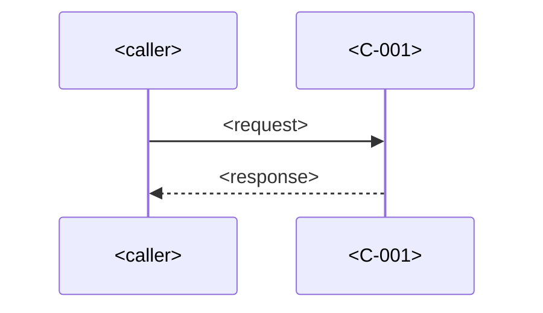

# Low Level Design — <Feature Name>

| Field    | Value                                     |
| -------- | ----------------------------------------- |
| Feature  | `<NNN-feature-slug>`                      |
| Status   | Draft \| In review \| Approved \| Superseded |
| Revised  | `<YYYY-MM-DD>`                            |
| Author   | architect (agent-sdlc)                    |
| Source   | `docs/sdlc/<NNN-feature-slug>/hld.md`     |

## C-001 — <component name>

### Module and file structure

| Path | Purpose |
| ---- | ------- |
| `<src/…/file.ts>` | |

### Interfaces and types

```ts
export interface I<Name> {
  <field>: <type>;
  <optionalField>?: <type>;
}
```

### Method signatures

| Module | Signature | Returns | Error cases |
| ------ | --------- | ------- | ----------- |
| `<file>` | `const <name> = (<param>: <type>) => …` | `<type>` | `<error>` when `<condition>` |

### State management

| State | Owner | Lifetime | Updated by | On concurrent update |
| ----- | ----- | -------- | ---------- | -------------------- |
|       |       | Request \| Session \| Process \| Persisted | | Last write wins \| Reject \| Merge |

### Test seams

| Seam | Injected as | Replaced in tests by | Enables testing |
| ---- | ----------- | -------------------- | --------------- |
|      | Constructor arg \| Parameter \| Provider | | `<FR-###>` |

## Data schemas

### <table or collection name>

| Field | Type | Null | Default | Constraint |
| ----- | ---- | ---- | ------- | ---------- |
|       |      | Yes \| No | | PK \| FK → `<table>` \| Unique \| Check `<expr>` |

**Indexes**

| Index | Fields | Serves query |
| ----- | ------ | ------------ |
|       |        |              |

## API contracts

### `<METHOD> <path>`

<One sentence: what it does. Implements `<FR-###>`.>

**Request**

```json
{}
```

**Responses**

| Status | Meaning | Body |
| ------ | ------- | ---- |
| 200    |         | `<shape>` |
| 4xx    |         | Error body |

**Error body**

```json
{ "code": "<string>", "message": "<string>", "details": [] }
```

## Sequence diagrams

### <flow name> (`<FR-###>`)



## Validation and error handling

| Rule | Enforced in | On failure | Logged as | Caller sees |
| ---- | ----------- | ---------- | --------- | ----------- |
| `<VR-1>` | `<module>` | `<throw \| return>` | logDebug \| logError \| none | `<status / message>` |

## Named constants

| Constant | Value | Unit | Declared in | Purpose |
| -------- | ----- | ---- | ----------- | ------- |
| `<CONSTANT_NAME>` | | ms \| items \| count \| — | `<module>` | |

## Traceability

| Module | Component | Implements FR |
| ------ | --------- | ------------- |
| `<file>` | `<C-001>` | `<FR-###>` |

## Assumptions

- ASSUMPTION: …

## Open questions

- OPEN QUESTION: … *(blocks: `<module or C-00X>`)*
